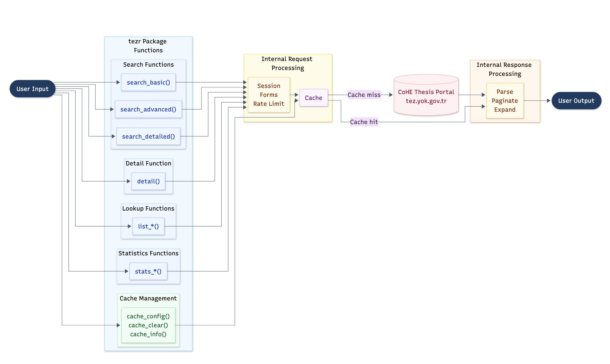

# Design History and Architecture

This note documents why `tezr` has its current structure. It is written for
rOpenSci review and future maintenance.

## Design History

`tezr` began as infrastructure for a paper. The paper needed thesis-level data
from Türkiye's National Thesis Center, the mandatory national archive for
graduate thesis records. The portal exposes rich public metadata, but it has no
public API, no bulk export, no query language, and a 2,000-record visible result
cap. A paper based on broad National Thesis Center searches therefore needed
scripted retrieval, deduplication, and completeness checks rather than manual
downloads from the web interface.

The first package version translated that paper need into R functions. The
early package scaffold implemented the portal's basic, advanced, and detailed
search modes, plus detail-page retrieval. This kept the package close to the
source portal and made it possible to compare package results with web-interface
results.

The next development stage came from using the package to build manuscript data.
Broad economics searches exposed the practical limits of the portal. Searches
could exceed the 2,000-record cap, detail records were needed for advisor,
abstract, keyword, subject, and access-status fields, and repeated manuscript
runs would otherwise hit the same portal pages many times. That stage produced
year-range pagination, session-local caching, lookup helpers, richer detail
parsing, aggregate statistics, and tests based on saved fixtures.

The manuscript then developed around economics applications. Those applications
were useful stress tests for `tezr`, but they are not the package's public
scope. The paper is still being revised in a new version, so `tezr` now keeps a
clear boundary between retrieval and analysis. The package retrieves, parses,
paginates, caches, and checks National Thesis Center metadata. Research projects
decide what data snapshots to save and how to validate, model, and interpret
them.

Before rOpenSci submission, the package was cleaned up for public review. The
API was simplified, bilingual metadata fields were clarified, parser and
pagination behavior were hardened, and package examples were changed to show
representative output without requiring live portal requests. Request behavior
is now documented through `request_config()`, a package-identifying user agent,
request delays, retries, and responsible-use guidance. The parser was also
updated after the National Thesis Center changed its search-result markup.

## Architecture Overview

The exported API is small and task oriented. Most internal code exists to make
those functions reliable against a web portal designed for interactive use.

## Component Map

| Component | Files | Responsibility |
| --- | --- | --- |
| Search API | `R/search.R` | Exported searches, argument normalization, cache keys, pagination triggers, and result attributes |
| Forms | `R/forms.R` | Portal form payloads for basic, advanced, and detailed searches |
| Requests | `R/request.R`, `R/session.R` | Sessions, cookies, headers, user agent configuration, retries, pacing, and shared search execution |
| Pagination | `R/paginate.R` | Adaptive year-range splitting for searches above the 2,000-record cap |
| Search parsing | `R/parse-results.R` | Search result pages to standard thesis rows |
| Detail retrieval | `R/detail.R` | Single and batch detail requests, cache checks, bounded parallel fetching, and result binding |
| Detail parsing | `R/parse-details.R` | Detail pages to bilingual metadata, advisor fields, subjects, keywords, access status, and public links |
| Lookups | `R/lookup.R`, `data-raw/sysdata.R` | Portal labels and identifier resolution |
| Statistics | `R/statistics.R` | Portal aggregate counts by year, university, subject, and thesis type |
| Cache | `R/cache.R` | Session-local caches for searches, year ranges, details, and lookup values |
| Utilities | `R/utils.R`, `R/constants.R` | Text cleaning, validation, language labels, endpoints, and shared helpers |

## Retrieval Flows

A search call starts in `search_basic()`, `search_advanced()`, or
`search_detailed()`. `R/search.R` validates the arguments, resolves portal
identifiers when needed, and asks `R/forms.R` to build the form payload.
`R/request.R` then checks the search cache and submits the form when no usable
cache entry exists. `R/parse-results.R` parses the returned page.

If the portal reports more records than it returned, `R/search.R` decides
whether pagination is possible. `R/paginate.R` splits the query into year
ranges, fetches each range, merges the rows, deduplicates by thesis number, and
records incomplete single-year ranges as attributes.

A detail call starts with `detail_id` values returned by a search. `R/detail.R`
separates cached and uncached records. It requests uncached detail pages in
bounded batches, then `R/parse-details.R` parses the richer metadata into one
row per thesis.

Lookup and statistics calls are simpler. They read portal-provided lists or
aggregate tables, normalize them, cache them when appropriate, and return
tibbles.

## Main Design Decisions

### Mirror the portal instead of inventing a query language

The National Thesis Center is organized around forms. `tezr` keeps that model
so package calls can be compared with the source portal. `search_detailed()`
accepts vector-valued inputs for convenience, expands them into portal-compatible
calls, and deduplicates the merged records.

### Use year-range pagination for broad searches

The 2,000-record cap is the main retrieval constraint. Year ranges are available
in the advanced and detailed forms, have a clear order, and preserve the user's
substantive filters. The paginator re-splits overflowing ranges until it reaches
single years. It warns when a single year still exceeds the cap.

### Keep detail retrieval separate

Search results are useful for screening and deduplication. Detail pages contain
the fields needed for analysis, including advisors, abstracts, keywords, page
counts, access status, and public links. Keeping `detail()` separate lets users
request full records only when they need them.

### Cache only within the R session

The cache reduces repeated portal requests during interactive work and examples.
It does not create hidden persistent state. Users who need durable data should
save returned objects explicitly in their analysis workflow.

### Keep parser logic explicit

The portal returns bilingual metadata, inconsistent labels, encoded identifiers,
old and new result layouts, and detail pages with missing or duplicated fields.
The parser code uses small named helpers so each case can be tested and fixed
without changing the public API.

### Build in responsible request behavior

The package identifies itself with a package-specific user agent by default. It
paces requests, retries transient failures, refreshes stale sessions, and
documents user-agent overrides for institutional or network requirements. It
retrieves public metadata and does not download thesis full text at scale,
bypass access restrictions, collect credentials, or store private user data.

## Why the Package Looks Large in Static Checks

The package exports 17 functions, but static checks see a larger internal
function graph. That shape is deliberate. Most of the internal surface supports
one of four needs.

- Search modes need separate normalization, form, cache, request, and pagination
  paths.
- Parsers need to handle bilingual fields, missing values, portal labels, detail
  identifiers, and markup changes.
- Pagination needs queue management, range cache keys, split heuristics,
  overflow warnings, deduplication, and completeness attributes.
- Tests need fixture-driven coverage for result pages, detail pages, cache
  behavior, lookup behavior, request behavior, and edge cases.

The design favors narrow helpers over large scraping functions because each
helper has a clear failure mode. That matters for a package that depends on a
live web portal rather than a stable API contract.

## Boundaries

The current design leaves several things out.

- No browser automation. Plain HTTP requests are easier to test and run in
  non-interactive environments.
- No persistent package cache. Durable storage belongs in the user's analysis
  repository.
- No full-text harvesting. The package focuses on public metadata and respects
  access-status signals.
- No automatic splitting across every possible field. That could reduce some
  single-year overflow cases, but it would multiply requests and make retrieval
  harder to explain.
- No downstream bibliometric toolkit. Packages such as `bibliometrix`, `igraph`,
  `stm`, and ordinary tidyverse tools are better suited for analysis after
  `tezr` retrieves the metadata.

## Maintenance Notes

The most likely maintenance burden is portal markup change. The package is
organized so future fixes can target the affected layer.

- Form changes should mostly affect `R/forms.R` and search argument handling in
  `R/search.R`.
- Session or header changes should mostly affect `R/session.R` and `R/request.R`.
- Result-page changes should mostly affect `R/parse-results.R` and its fixtures.
- Detail-page changes should mostly affect `R/parse-details.R` and its fixtures.
- Pagination behavior should mostly affect `R/paginate.R`.

When parser behavior changes, update or add fixtures in
`tests/testthat/fixtures` before changing high-level search behavior. This keeps
live portal variation separate from package regressions.
