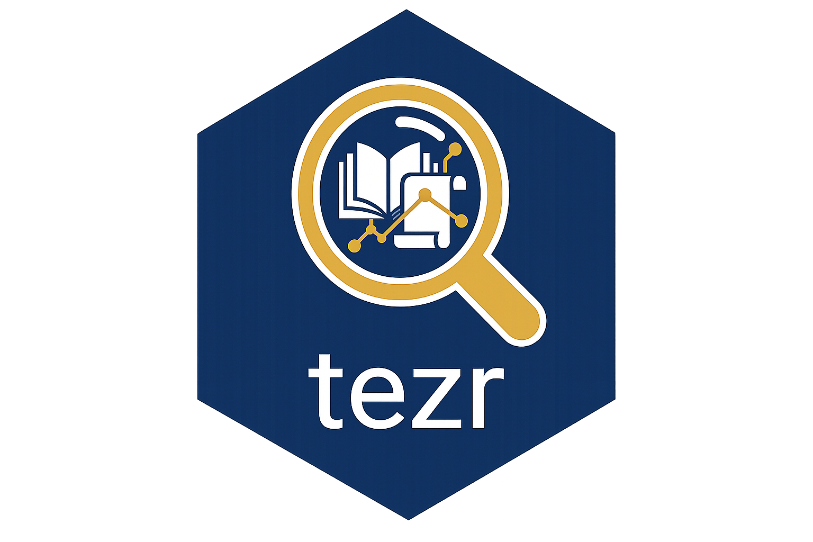

<!-- README.md is generated from README.Rmd. Please edit that file -->

# tezr 

<!-- badges: start -->

[](https://github.com/emraher/tezr/actions/workflows/R-CMD-check.yaml)
[](https://github.com/emraher/tezr/actions/workflows/pkgcheck.yaml)
[](https://app.codecov.io/gh/emraher/tezr?branch=main)
[](https://lifecycle.r-lib.org/articles/stages.html#maturing)
[](https://www.repostatus.org/#active)
<!-- badges: end -->

`tezr` retrieves, parses, caches, and checks thesis metadata from
Turkiye’s [National Thesis Center](https://tez.yok.gov.tr) (NTC, Ulusal
Tez Merkezi).

The NTC is the Council of Higher Education’s national portal for
graduate thesis records from Turkish universities. It exposes thesis
titles, authors, institutions, degree types, languages, subjects,
abstracts, advisors, page counts, access status, and detail-page links
through a public web interface. The portal contains close to one million
records, but it has no documented public API, no bulk export, and a
visible-result cap of 2,000 rows per query.

`tezr` turns that capped web-only archive into a scriptable R workflow.
It maps the basic, advanced, and detailed search forms into R functions.
It resolves valid university, institute, division, discipline, and
subject labels. It retrieves detail pages, parses bilingual metadata
into tibbles, deduplicates merged searches, caches repeated queries,
paginates large searches by adaptive year ranges, and exposes statistics
functions for retrieval checks.

`tezr` is not affiliated with, endorsed by, or connected to YÖK, the
Council of Higher Education, or the National Thesis Center.

## Installation

``` r
# install.packages("pak")
pak::pak("emraher/tezr")
```

## Quick Start

``` r
library(tezr)
```

Search results use `title_original` and `title_translation`. Detail
records use `abstract_original` and `abstract_translation`.

``` r
household <- search_basic(keyword = "hanehalkı")
dplyr::glimpse(household)
```

A representative search result has this shape.

    #> Rows: 8
    #> Columns: 13
    #> $ thesis_no         <chr> "967755", "975988", "955779", "974976", "960162", "9…
    #> $ title_original    <chr> "Hanehalki gelir ve tuketim analizi 1", "Hanehalki g…
    #> $ title_translation <chr> "Household income and consumption analysis 1", "Hous…
    #> $ author            <chr> "PERIHAN EZGI BALLI", "CENAP ALAYBEYI", "SECIL ALMIS…
    #> $ university        <chr> "Bandirma Onyedi Eylul Universitesi", "Harran Univer…
    #> $ year              <int> 2025, 2025, 2025, 2024, 2023, 2022, 2021, 2020
    #> $ thesis_type_tr    <chr> "Doktora", "Yuksek Lisans", "Yuksek Lisans", "Yuksek…
    #> $ thesis_type_en    <chr> "Doctorate", "Master", "Master", "Master", "Doctorat…
    #> $ language_tr       <chr> "Turkce", "Turkce", "Turkce", "Turkce", "Turkce", "I…
    #> $ language_en       <chr> "Turkish", "Turkish", "Turkish", "Turkish", "Turkish…
    #> $ subject_tr        <chr> "Ekonomi", "Ekonomi", "Ekonomi", "Ekonomi", "Ekonomi…
    #> $ subject_en        <chr> "Economics", "Economics", "Economics", "Economics", …
    #> $ detail_id         <chr> "TCKf4ksTOVsOBqUcPYMKWQ", "LypZzbdoWcG0f3c62wverw", …

``` r
climate_change <- search_advanced(
  keyword = "iklim değişikliği",
  year_start = 2015,
  group = "science"
)
dplyr::glimpse(climate_change)
```

    #> Rows: 24
    #> Columns: 13
    #> $ thesis_no         <chr> "9677551", "9759882", "9557793", "9749764", "9601625…
    #> $ title_original    <chr> "Iklim degisikligi 1", "Iklim degisikligi 2", "Iklim…
    #> $ title_translation <chr> "Climate change 1", "Climate change 2", "Climate cha…
    #> $ author            <chr> "PERIHAN EZGI BALLI", "CENAP ALAYBEYI", "SECIL ALMIS…
    #> $ university        <chr> "Ankara Universitesi", "Istanbul Universitesi", "Ege…
    #> $ year              <int> 2015, 2016, 2017, 2018, 2019, 2020, 2021, 2022, 2023…
    #> $ thesis_type_tr    <chr> "Doktora", "Yuksek Lisans", "Yuksek Lisans", "Yuksek…
    #> $ thesis_type_en    <chr> "Master", "Doctorate", "Master", "Doctorate", "Maste…
    #> $ language_tr       <chr> "Turkce", "Turkce", "Turkce", "Turkce", "Turkce", "I…
    #> $ language_en       <chr> "Turkish", "Turkish", "Turkish", "Turkish", "Turkish…
    #> $ subject_tr        <chr> "Cevre Bilimleri; Ekonomi", "Cevre Bilimleri; Ekonom…
    #> $ subject_en        <chr> "Environmental Sciences; Economics", "Environmental …
    #> $ detail_id         <chr> "TCKf4ksTOVsOBqUcPYMKWQ", "LypZzbdoWcG0f3c62wverw", …

``` r
phd_theses <- search_detailed(
  university = "Ankara Üniversitesi",
  division = "İktisat Ana Bilim Dalı",
  thesis_type = "phd",
  year_start = 2020
)
head(phd_theses)
```

    #> # A tibble: 6 × 13
    #>   thesis_no title_original             title_translation author university  year
    #>   <chr>     <chr>                      <chr>             <chr>  <chr>      <int>
    #> 1 9677551   Parasal aktarım mekanizma… Domestic credit … PERIH… Ankara Un…  2020
    #> 2 9759882   1980 sonrası Türkiye'de a… Changes in sunfl… CENAP… Ankara Un…  2021
    #> 3 9557793   Doğrudan yabancı yatırıml… Foreign direct i… SECIL… Ankara Un…  2022
    #> 4 9749764   Enerji kullanımı ile G-20… Panel data analy… RUMEY… Ankara Un…  2023
    #> 5 9601625   Finansal liberalleşme sür… Fragility during… SAMI … Ankara Un…  2024
    #> 6 9465806   Azerbaycan'ın ekolojik ay… An analysis of A… ADIL … Ankara Un…  2025
    #> # ℹ 7 more variables: thesis_type_tr <chr>, thesis_type_en <chr>,
    #> #   language_tr <chr>, language_en <chr>, subject_tr <chr>, subject_en <chr>,
    #> #   detail_id <chr>

``` r
details <- detail(phd_theses$detail_id[1])

details |>
  tidyr::pivot_longer(
    cols = dplyr::everything(),
    names_to = "colname",
    values_to = "colvalue"
  ) |>
  print(n = 24)
```

    #> # A tibble: 24 × 2
    #>    colname              colvalue
    #>    <chr>                <chr>
    #>  1 thesis_no            9677551
    #>  2 title_original       Parasal aktarim mekanizmasi cercevesinde ozel sektore k…
    #>  3 title_translation    Domestic credit to private sector and monetary transmis…
    #>  4 author               PERIHAN EZGI BALLI
    #>  5 advisor              PROF. DR. HASAN SAHIN
    #>  6 co_advisor           <NA>
    #>  7 university           Ankara Universitesi
    #>  8 institute            Sosyal Bilimler Enstitusu
    #>  9 division             Iktisat Ana Bilim Dali
    #> 10 year                 2020
    #> 11 pages                153
    #> 12 thesis_type_tr       Doktora
    #> 13 thesis_type_en       Doctorate
    #> 14 language_tr          Turkce
    #> 15 language_en          Turkish
    #> 16 subject_tr           Ekonomi; Enerji
    #> 17 subject_en           Economics; Energy
    #> 18 abstract_original    Enerji piyasasi duzenlemelerinin ana ekseninde enerji a…
    #> 19 abstract_translation This thesis consists of three essays on energy market r…
    #> 20 keywords_tr          Enerji piyasalari; Duzenleme; Elektrik
    #> 21 keywords_en          Energy markets; Regulation; Electricity
    #> 22 access_status        open
    #> 23 pdf_url              https://tez.yok.gov.tr/UlusalTezMerkezi/tezIndir.jsp?id…
    #> 24 detail_url           https://tez.yok.gov.tr/UlusalTezMerkezi/tezDetay.jsp?id…

Save returned objects after large queries so later analysis does not
repeat the same portal requests.

``` r
saveRDS(climate_change, "climate_change_theses.rds")
readr::write_rds(climate_change, "climate_change_theses.readr.rds")
```

## Scope

The primary rOpenSci category is data retrieval. The secondary use case
is bibliometrics and thesis metadata analysis.

Adjacent packages such as
[`rentrez`](https://docs.ropensci.org/rentrez/) and
[`europepmc`](https://docs.ropensci.org/europepmc/) wrap formal
scholarly APIs. `tezr` differs because the NTC only exposes a web portal
and uses structured form fields rather than a query language.
[`bibliometrix`](https://www.bibliometrix.org/) focuses on bibliometric
analysis after data are already available. `tezr` focuses on retrieval,
parsing, completeness checks, and preparation of NTC thesis metadata for
analysis. Turkish higher-education data packages, when available,
usually target institutional or public statistics sources rather than
the NTC thesis-record portal.

## Responsible Use

Use `tezr` for academic, reproducible research workflows. Respect the
NTC portal, avoid unnecessary repeated requests, and cache or save
results locally. Do not use the package to bypass access restrictions,
to scrape thesis full text at scale, or to redistribute metadata in ways
that conflict with the source portal’s terms.

When publishing results, cite both `tezr` and the NTC or Council of
Higher Education data source. Also document the query terms, filters,
retrieval dates, and any completeness warnings returned by `tezr`.

The project follows the [rOpenSci Code of
Conduct](https://ropensci.org/code-of-conduct/). Do not post private
researcher data, access tokens, local cookies, or sensitive
institutional details in issues or pull requests.

## Request Behavior

`tezr` sends a package-identifying user agent by default. Override it
with `request_config(user_agent = "...")` or `TEZR_USER_AGENT` if your
institution or the portal requires a different header.

``` r
request_config(user_agent = "my-lab-contact@example.edu")
request_config(reset = TRUE)
```

Set `request_config(verbose = FALSE)` or `TEZR_VERBOSE=false` to silence
informational progress messages. Warnings and errors are still shown.

The package applies a two-second request delay, retries requests up to
three times through `httr2`, refreshes sessions after 50 logical
requests or 20 minutes, and caches searches, range chunks, details, and
lookups in memory. Detail requests use bounded parallel fetching for
uncached records.

## More Than Downloading

`tezr` adds workflow behavior that is not available from the NTC web
interface.

- Filtered basic, advanced, and detailed search functions.
- Lookup resolution for valid NTC labels and IDs.
- Adaptive pagination for queries that exceed the 2,000-row portal cap.
- Parsing of bilingual search and detail metadata into rectangular
  tibbles.
- Deduplication for expanded multi-value detailed searches.
- Completeness attributes that record reported totals, pagination
  status, and single-year overflow.
- In-memory caching for repeated searches, detail pages, range chunks,
  and lookup lists.
- Aggregate statistics functions that help compare retrieved records
  against portal counts.

## Limitations

- The NTC has no public API. Markup, form fields, cookies, or JavaScript
  behavior may change without notice.
- Search results are capped at 2,000 rows per portal request.
- Auto-pagination cannot split below a single calendar year. Single-year
  overflow can still leave results incomplete.
- Metadata quality is uneven. Fields can be missing, duplicated,
  inconsistently translated, or encoded differently across records.
- The package retrieves metadata and detail-page links. It does not
  download thesis full text.
- The package depends on live portal availability. Network failures,
  certificate issues, and server-side blocking can affect retrieval.

## Maintenance

The package is maintained as active research software. The current
public API is intended to be review-ready, but the development version
may still make breaking changes in response to rOpenSci review before a
stable release. The maintainer commits to at least two years of
maintenance after review acceptance, including fixes for NTC markup
changes when feasible.

## Citation

Use `citation("tezr")` for the preferred package citation. Also cite the
National Thesis Center or Council of Higher Education as the source of
thesis metadata and include the date you retrieved the data.

## Learn More

- [Getting
  Started](https://eremrah.com/tezr/articles/getting-started.html)
- [Analysis
  Examples](https://eremrah.com/tezr/articles/analysis-examples.html)
- [Function Reference](https://eremrah.com/tezr/reference/index.html)
- [Contributing](CONTRIBUTING.md)
