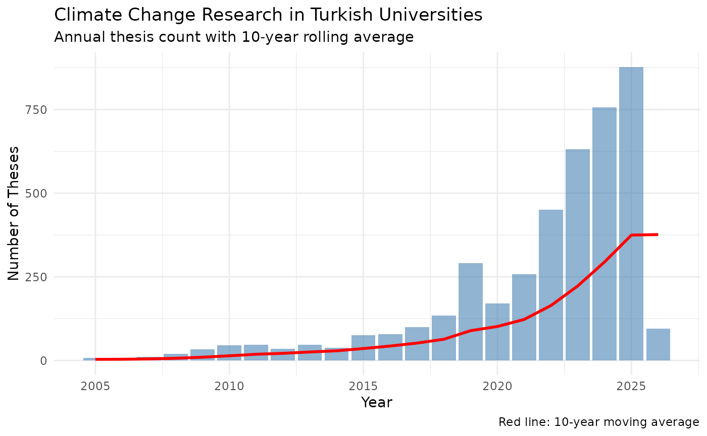
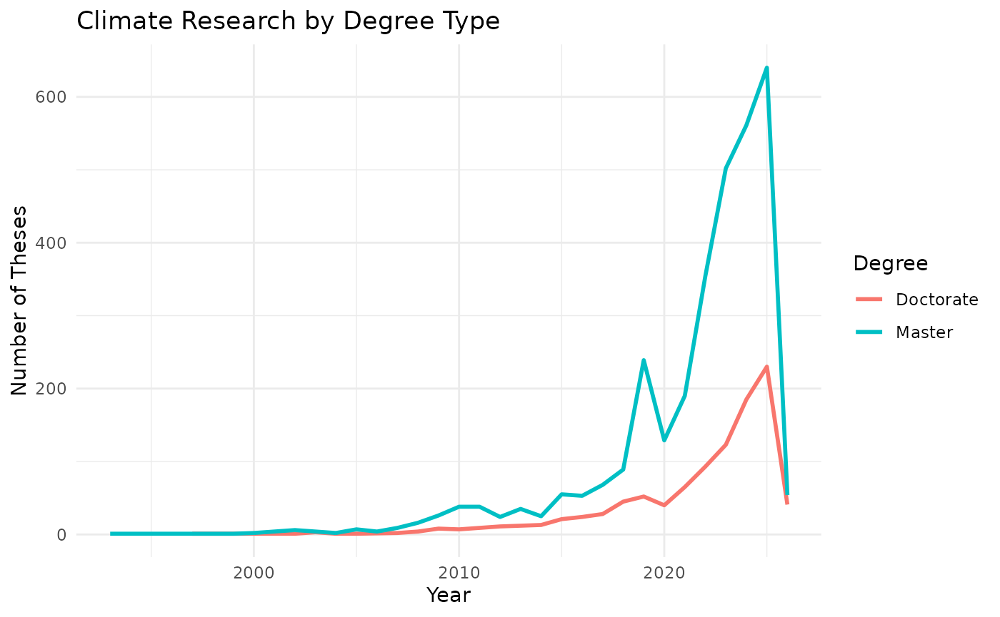
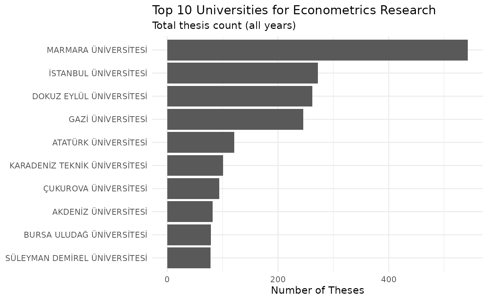
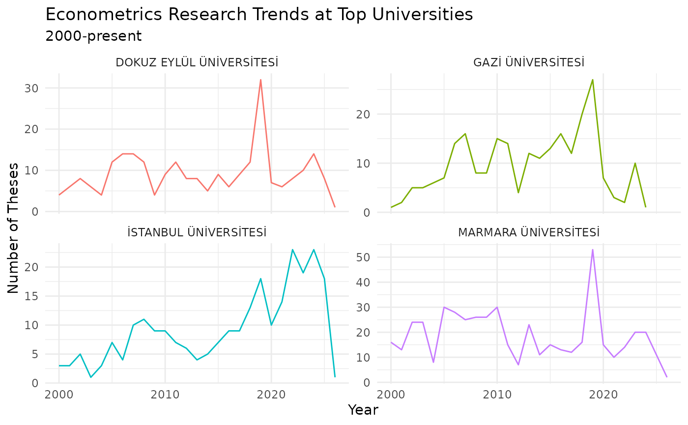
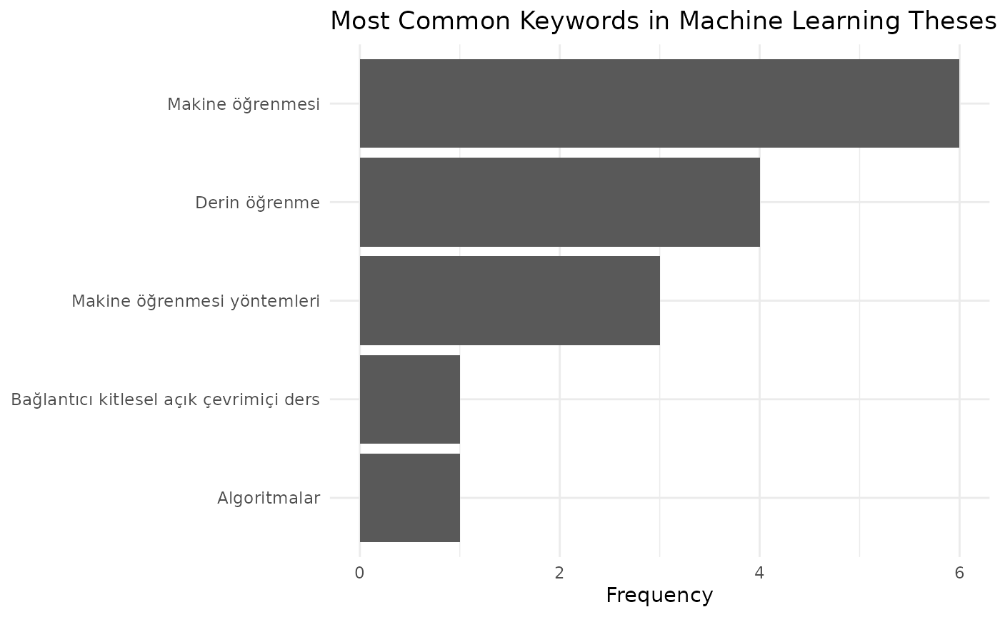

# Analysis Examples

This vignette demonstrates three very simple analysis workflows using
thesis metadata from the NTC. Each example starts with data collection
and ends with a table or plot. The workflows cover research trends,
institutional comparisons, and keyword mining.

**Prerequisites:** Familiarity with dplyr and ggplot2. See the [Getting
Started](https://eremrah.com/tezr/articles/getting-started.md) vignette
for search function details.

``` r
library(tezr)
library(dplyr)
library(ggplot2)
library(tidyr)
library(stringr)

rolling_mean_right <- function(x, k) {
  vapply(seq_along(x), function(i) {
    if (i < k) {
      return(NA_real_)
    }
    mean(x[(i - k + 1):i])
  }, numeric(1))
}
```

## Example 1: Research Trends Over Time

Suppose you want to track how interest in a topic has changed across
decades. This is a standard starting point for bibliometric analysis.
You can replace the search term with your own topic of interest.

### Collecting Data

Let’s use
[`search_advanced()`](https://eremrah.com/tezr/reference/search_advanced.md)
with the `search_field` parameter set to all. The result is a tibble of
matching records with year, author, university, and other metadata.

``` r
# Search for "iklim değişikliği" (climate change) in thesis titles
climate <- search_advanced(keyword = "iklim değişikliği",
                           search_field = "all",
                           max_search_results = Inf)
glimpse(climate)
#> Rows: 4,233
#> Columns: 13
#> $ thesis_no         <chr> "127833", "211146", "160151", "143999", "64…
#> $ title_original    <chr> "Küresel ısınma Avrupa Birliği ve Türkyie",…
#> $ title_translation <chr> "Global warming European Union and Turkey",…
#> $ author            <chr> "FİKRET MAZI", "PINAR BAL", "AYŞE KAYA DÜND…
#> $ university        <chr> "ANKARA ÜNİVERSİTESİ", "MARMARA ÜNİVERSİTES…
#> $ year              <int> 2003, 2007, 2005, 2004, 1997, 2008, 2008, 2…
#> $ thesis_type_tr    <chr> "Doktora", "Doktora", "Yüksek Lisans", "Yük…
#> $ thesis_type_en    <chr> "Doctorate", "Doctorate", "Master", "Master…
#> $ language_tr       <chr> "Türkçe", "İngilizce", "Türkçe", "Türkçe", …
#> $ language_en       <chr> "Turkish", "English", "Turkish", "Turkish",…
#> $ subject_tr        <chr> "Kamu Yönetimi", "Uluslararası İlişkiler", …
#> $ subject_en        <chr> "Public Administration", "International Rel…
#> $ detail_id         <chr> "0urt544xEr8UdoqaY8b6Hw", "uY6beSruWeTBJHDZ…
```

### Yearly Counts with Rolling Average

Let’s count theses per year and smooth with a 10-year rolling average.
The rolling average reveals sustained growth versus one-off spikes. We
can adjust `k` for a wider or narrower window.

``` r
# Count theses per year
yearly_counts <- climate |>
  count(year) |>
  arrange(year) |>
  mutate(
    year_numeric = as.numeric(year),
    # 10-year rolling average to smooth yearly variation
    rolling_avg = rolling_mean_right(n, k = 10)
  )

# Bar chart with rolling average overlay
yearly_counts |> 
  na.omit() |> 
  ggplot(aes(x = year_numeric)) +
  geom_col(aes(y = n), fill = "steelblue", alpha = 0.6) +
  geom_line(aes(y = rolling_avg), color = "red", linewidth = 1) +
  labs(
    title = "Climate Change Research in Turkish Universities",
    subtitle = "Annual thesis count with 10-year rolling average",
    x = "Year",
    y = "Number of Theses",
    caption = "Red line: 10-year moving average"
  ) +
  theme_minimal(base_size = 11)
```



### Master’s vs PhD Trends

We can split by degree type to see what drives growth. Filter to the two
main types for a readable plot.

``` r
# Compare master's and PhD thesis counts over time
type_trends <- climate |>
  filter(thesis_type_en %in% c("Master", "Doctorate")) |>
  count(year, thesis_type_en) |>
  mutate(year = as.numeric(year))

type_trends |> 
  ggplot(aes(x = year, y = n, color = thesis_type_en)) +
  geom_line(linewidth = 1) +
  labs(
    title = "Climate Research by Degree Type",
    x = "Year",
    y = "Number of Theses",
    color = "Degree"
  ) +
  theme_minimal(base_size = 11)
```



## Example 2: Comparing Universities

Suppose we want to identify which universities produce the most research
in a given field. You can replace `"Ekonometri"` with any subject from
[`list_subjects()`](https://eremrah.com/tezr/reference/list_subjects.md).

### Collecting University-Level Data

``` r
# All econometrics theses, counted by university
econ_theses <- search_detailed(subject = "Ekonometri",
                               max_search_results = Inf)

uni_counts <- econ_theses |>
  count(university, sort = TRUE)

uni_counts |> 
  head(10)
#> # A tibble: 10 × 2
#>    university                        n
#>    <chr>                         <int>
#>  1 MARMARA ÜNİVERSİTESİ            543
#>  2 İSTANBUL ÜNİVERSİTESİ           272
#>  3 DOKUZ EYLÜL ÜNİVERSİTESİ        262
#>  4 GAZİ ÜNİVERSİTESİ               246
#>  5 ATATÜRK ÜNİVERSİTESİ            121
#>  6 KARADENİZ TEKNİK ÜNİVERSİTESİ   101
#>  7 ÇUKUROVA ÜNİVERSİTESİ            94
#>  8 AKDENİZ ÜNİVERSİTESİ             82
#>  9 BURSA ULUDAĞ ÜNİVERSİTESİ        79
#> 10 SÜLEYMAN DEMİREL ÜNİVERSİTESİ    78
```

### Top Universities Bar Chart

Let’s create a simple bar chart. Horizontal bars make long Turkish
university names easy to read.

``` r
uni_counts |> 
  head(10) |> 
  ggplot(aes(x = n, y = reorder(university, n))) +
  geom_col() +
  labs(
    title = "Top 10 Universities for Econometrics Research",
    subtitle = "Total thesis count (all years)",
    x = "Number of Theses",
    y = NULL
  ) +
  theme_minimal(base_size = 11)
```



### University Trends Over Time

Let’s compare the top four universities from 2000 onward.

``` r
top4_unis <- uni_counts$university[1:4]

# Filter to top 4 universities, 2000 onward
uni_trends <- econ_theses |>
  filter(university %in% top4_unis) |>
  mutate(year = as.numeric(year)) |>
  filter(year >= 2000) |>
  count(year, university)

uni_trends |> 
  ggplot(aes(x = year, y = n, color = university)) +
  geom_line() +
  labs(
    title = "Econometrics Research Trends at Top Universities",
    subtitle = "2000-present",
    x = "Year",
    y = "Number of Theses",
    color = "University"
  ) +
  facet_wrap(~university, scales = "free_y") +
  theme_minimal(base_size = 11) +
  theme(legend.position = "none")
```



### PhD-to-Total Ratio

Let’s assume a higher PhD ratio suggests a more research-intensive
program.

``` r
# Compute PhD share at each top university
top_unis <- uni_counts$university[1:10]

degree_comparison <- econ_theses |>
  filter(university %in% top_unis) |>
  filter(thesis_type_en %in% c("Master", "Doctorate")) |>
  count(university, thesis_type_en) |>
  pivot_wider(names_from = thesis_type_en, values_from = n, values_fill = 0) |>
  mutate(phd_ratio = Doctorate / (Doctorate + Master)) |> 
  arrange(desc(phd_ratio))

degree_comparison
#> # A tibble: 10 × 4
#>    university                    Doctorate Master phd_ratio
#>    <chr>                             <int>  <int>     <dbl>
#>  1 İSTANBUL ÜNİVERSİTESİ               117    155     0.430
#>  2 ATATÜRK ÜNİVERSİTESİ                 50     71     0.413
#>  3 AKDENİZ ÜNİVERSİTESİ                 31     51     0.378
#>  4 BURSA ULUDAĞ ÜNİVERSİTESİ            28     51     0.354
#>  5 KARADENİZ TEKNİK ÜNİVERSİTESİ        33     68     0.327
#>  6 GAZİ ÜNİVERSİTESİ                    70    176     0.285
#>  7 DOKUZ EYLÜL ÜNİVERSİTESİ             65    197     0.248
#>  8 ÇUKUROVA ÜNİVERSİTESİ                23     71     0.245
#>  9 MARMARA ÜNİVERSİTESİ                121    422     0.223
#> 10 SÜLEYMAN DEMİREL ÜNİVERSİTESİ        14     64     0.179
```

## Example 3: Keyword and Abstract Analysis

You can extract research themes from thesis abstracts and keywords.
Detail records include `keywords_tr`, `keywords_en`,
`abstract_original`, and `abstract_translation`. This example fetches
details for all matching theses, so it is slow.

### Collecting Detailed Metadata

``` r
# Search for machine learning theses
ml_search <- search_basic("makine öğrenmesi",
                          max_search_results = Inf)

# Fetch full details (abstracts, keywords, advisor, PDF URLs)
ml_search_sample <- ml_search |> 
  slice_sample(n = 20)

ml_details <- detail(ml_search_sample$detail_id)
```

### Keyword Frequency

The `keywords_tr` field contains semicolon separated terms. Let’s split
them, trim whitespace, and count.

``` r
# Parse comma-separated keywords into individual rows
keywords <- ml_details |>
  filter(!is.na(keywords_tr)) |>
  select(thesis_no, keywords_tr) |>
  mutate(keywords_tr = str_split(keywords_tr, ";")) |>
  unnest(keywords_tr) |>
  mutate(keyword = str_trim(keywords_tr)) |>
  filter(keyword != "")

# Top 5 keywords
keyword_freq <- keywords |>
  count(keyword, sort = TRUE) |>
  head(5)

keyword_freq |> 
  ggplot(aes(x = n, y = reorder(keyword, n))) +
  geom_col() +
  labs(
    title = "Most Common Keywords in Machine Learning Theses",
    x = "Frequency",
    y = NULL
  ) +
  theme_minimal(base_size = 11)
```



## Tips for Large-Scale Analysis

### Saving Results Locally

Save search results to disk after the first fetch. Load them in later
sessions to skip network calls. RDS preserves column types and CSV is
useful for sharing.

``` r
# Save after first fetch
saveRDS(econ_theses, "econ_theses.rds")
readr::write_csv(econ_theses, "econ_theses.csv")

# Load in a later session
econ_theses <- readRDS("econ_theses.rds")
```

### Incremental Detail Retrieval

For large result sets, fetch details in batches and save each batch.
This protects against interruptions — if the process stops, you only
lose the current batch.

``` r
batch_size <- 50
all_results <- search_basic("panel data")

for (i in seq(1, nrow(all_results), by = batch_size)) {
  batch_end <- min(i + batch_size - 1, nrow(all_results))
  batch <- all_results[i:batch_end, ]

  # detail() uses built-in rate limiting
  details <- detail(batch$detail_id)

  # Save each batch to disk
  saveRDS(details, paste0("details_batch_", i, ".rds"))

  # Optional short pause between batches
  Sys.sleep(2)
}
```

### Rate Limiting

tezr uses a built-in 2-second rate limit for request setup.
[`detail()`](https://eremrah.com/tezr/reference/detail.md) fetches
uncached records in parallel (up to 5 active requests), and large jobs
can still take time. Process in batches and cache results when possible.
